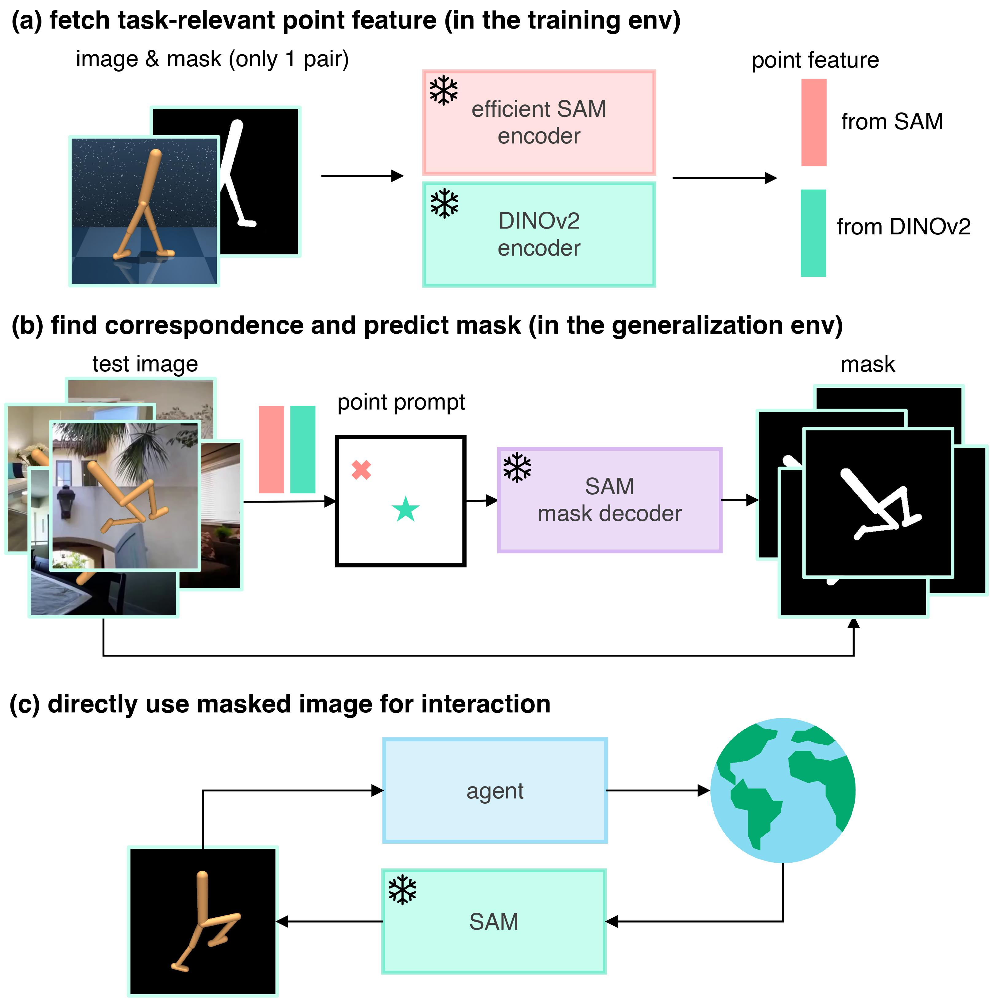

# Generalizable Visual Reinforcement Learning with Segment Anything Model
[Website](https://yanjieze.com/SAM-G/) | [Paper]()

We have released SAM-G -- **S**egment **A**nything **M**odel for
**G**eneralizable visual RL, a novel framework that leverages the promptable segmentation ability of Segment Anything Model (SAM) to enhance the generalization capabilities of visual RL agents. We utilize image features from DINOv2 and SAM to find correspondence as point prompts to SAM, and then SAM produces high-quality masked images for agents directly. Evaluated across 8 DMControl tasks and 3 Adroit tasks, SAM-G significantly improves the visual generalization ability without altering the RL agents’ architecture but merely their observations.


https://github.com/wadiuvatzy/SAM-G/assets/59699800/a8d51d58-26de-4662-a12c-02eb5bff4523


<p align="center">
  <br />
  <a href="./MODEL_CARD.md"></a>
  <a href="Python 3.8"></a>
  <a href="https://github.com/psf/black"></a>
</p>


<p align="center">
  
</p>


## Intallation
The installation is mainly based on [RL-ViGen](https://github.com/gemcollector/RL-ViGen). You can get access to a lot of RL benchmark here while we only adopted SAM-G to DMControl and Adroit. Below shows the way to create an environment to work on DMControl, If you want to use other benchmarks, you ran refer to RL-ViGen for more details.

Clone the SAM-G repo:
```
git clone https://github.com/wadiuvatzy/SAM-G
cd SAM-G/
```

Create a conda environment:
```
conda create -n sam-g python=3.8
```
Run the installation script:
```
bash setup/install_rlvigen.sh
```

 - DM-Control:  Our DM-Control also contains [mujoco_menagerie
](https://github.com/deepmind/mujoco_menagerie) as the basic component. We have incorporated all the relevant components associated with DM-Control in the first creating conda step.

 - Adroit: Adroit implementation is originated from [VRL3](https://github.com/microsoft/VRL3). And because of mujoco rendering bugs, you should refer to the branch **SAM-G/Adroit** to create a new adroit conda env for your experiment .


## Code Structure
- `algos`: contains the implementation of different algorithms.
- `cfgs`: contains the hyper-parameters for different algorithms and each tasks.
- `envs`: various RL-ViGen benchmark environments. In addtion, each sub-folder contains specific `README.md` for the introduction of the environment.
- `setup`: the installation scripts for conda envs.
- `third_party`: submodules from third parties. We won't frequently change the code in this folder.
- `wrappers`: includes the wrappers for each environment.
- `efficientvit`: the source code of [EfficientVit](https://github.com/mit-han-lab/efficientvit). We have added some APIs for convenience. 


## Extra Datasets
Some algorithms will use the [Places](http://places2.csail.mit.edu/download.html) dataset for data augmentation, which can be downloaded by running
```
wget http://data.csail.mit.edu/places/places365/places365standard_easyformat.tar
```
After downloading and extracting the data, add your dataset directory to the datasets list in `cfgs/aug_config.cfg`.

Also, since we will use a pretrained model of efficientViT for segmentation, we need to download a [l1-checkpoint](https://drive.google.com/file/d/1ji6NcDfZF8b2kkFn9DolnbaOGSqklECe/view) and place it in `efficientvit/checkpoints/`

## Training

We are using the `train.py` for training. If you want to use SAM-G, you need to modify some hyperparameters (explained below) in `cfgs/{ALGO}_config.yaml` (default is `cfgs/config.yaml` for DrQ-V2 algorithm). 

```
python train.py env=dmc task=walker_walk seed=0 
```

## Evaluation
To keep consistent with [dmcontrol-generalization-benchmark](https://github.com/nicklashansen/dmcontrol-generalization-benchmark), we will use `locoeval.py` to evaluate our models.

```
python locoeval.py --domain_name walker --task_name walk --model_dir $MODEL_DIR$ --seed 0 --use_SAM_g --original_image reference_images/walker_0.png --masked_image reference_images/walker_masked_0.jpg --extra_points_list 40 24 23 68 68 57 --extra_masked_images_list $PATH1$ $PATH2$
```

To change your evaluation level, you need to change the setting in `envs/DMCVGB/cfg/config.yaml`. By modifying the setting "background" there, you can evaluate the models under different setting (orignal, color-easy, color-hard, video-easy, video-hard). 


For more details, please refer to the `README.md` files for in the `env/DMCVGB` directory.

## Config
To use SAM-G, we need to manually fetch an original image from the domain and segment it out to get the corresponding masked image. For better segmentation, you may need to apply more materials for some tasks. Below are some explanation of the hyperparameter in each config file.

- use_SAM_g: if you want to use masked images as input to the RL agent instead of original image, you need to set this to be true.
- original_image: the original image you got from the domain. (for example, `reference_images/finger_0.png`)
- masked_image: the corresponding segmented image of original image. (for example, `reference_images/finger_masked_0.jpg`)
- extra_points_list: the list of extra points given to help SAM-G better understand the target object. You can just pick several points on the object and then feed them in. Can be empty.
- extra_masked_image_list: the list of auxiliary masked images of the original image. You can input a small part of the target object for each masked image. Can be empty. (for example, `reference_images/finger_masked_0_1.jpg`)


## Acknowledgements
Our training code is based on [DrQv2](https://github.com/facebookresearch/drqv2) and [RL-ViGen](https://github.com/gemcollector/RL-ViGen). 
And we also thank the codebase of [VRL3](https://github.com/microsoft/VRL3), [DMC-GB](https://github.com/nicklashansen/dmcontrol-generalization-benchmark), [SECANT](https://github.com/DrJimFan/SECANT), and [kyoran](https://github.com/kyoran/CarlaEnv-Benchmark).

## License
The majority of DrQ-v2, DMCGB, VRL3 is licensed under the MIT license. Habitat Lab, dmc2gym, mujoco-py are also licensed under the MIT license. However portions of the project are available under separate license terms: DeepMind,  mj_envs, and mjrl is licensed under the Apache 2.0 license.Gibson based task datasets, the code for generating such datasets, and trained models are distributed with [Gibson Terms of Use](https://storage.googleapis.com/gibson_material/Agreement%20GDS%2006-04-18.pdf) and under [CC BY-NC-SA 3.0 US license](https://creativecommons.org/licenses/by-nc-sa/3.0/us/). CARLA specific assets are distributed under CC-BY License. The ad-rss-lib library compiled and linked by the [RSS Integration build variant](Docs/adv_rss.md) introduces [LGPL-2.1-only License](https://opensource.org/licenses/LGPL-2.1). Unreal Engine 4 follows its [own license terms](https://www.unrealengine.com/en-US/faq).


## Citation
If you use our method or code in your research, please consider citing the paper as follows:
```
@article{Wang2023SAMG,
  title={Generalizable Visual Reinforcement Learning with Segment Anything Model},
  author={Ziyu Wang and Yanjie Ze and Yifei Sun and Zhecheng Yuan and Huazhe Xu},
  journal={arXiv}, 
  year={2023},
  }
```
